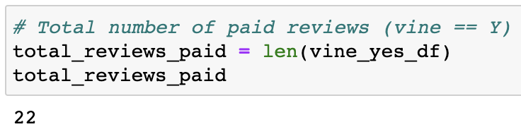
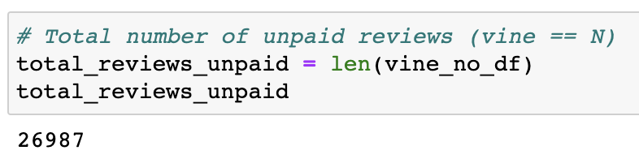
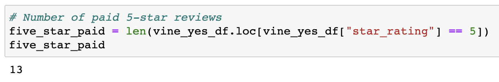
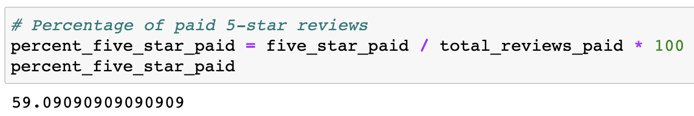
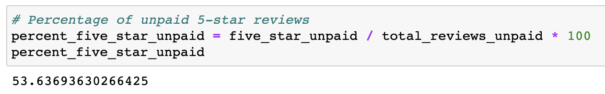
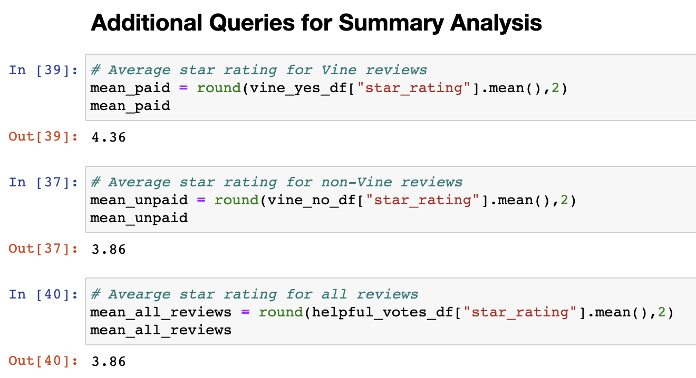

# Amazon Vine Review Analysis

## Overview of the Analysis
The Amazon Vine Program is a paid service provided by Amazon to manufactures and publishers. These companies pay a small fee to Amazon who will then provide reviews for their products. Amazon Vine members, who write the reviews, are then compensated for their reviews. This analysis on the reviews of shoes sold on Amazon was done to determine whether there is a positive bias towards the reviews that are written as part of the paid Vine program compared to reviews that are done by unpaid users of the product. 

## Results

From the entire dataset containing reviews of shoes sold on Amazon, we only analyzed the points of data that met certain criteria to ensure we were analyzing meaningful reviews. First, the data was filtered for reviews that have a total_votes of 20 or higher. The reviews were then further limited to those that had a helpful_votes ratio of at least 50%. 
\

* **How many Vine reviews and non-Vine reviews were there?**

There are 22 Vine reviews in the dataset.

There are 26,987 total non-Vine reviews in the dataset. 

\
\

* **How many Vine reviews were 5 stars? How many non-Vine reviews were 5 stars?**

13 Vine reviews are 5 stars.

14,475 non_vine reviews are 5 stars. 
\
\

* **What percentage of Vine reviews were 5 stars? What percentage of non-Vine reviews were 5 stars?**

59.1% of Vine reviews are 5 stars. 

53.6% of non-Vine reviews are 5 stars. 

## Summary 

The majority of both Vine and non-Vine reviews are 5 stars. Of the Vine reviews, 59.1% are 5 stars. And of the non-Vine reviews, 53.6% are 5 stars. This suggests a slight positivity bias in Vine reviews. However, of the total 27,009 helpful reviews we analyzed in the dataset, only 22 reviews were provided through the Vine program and the rest of the 26,987 were non-Vine reviews. The Vine reviews make up only 0.08% of the total reviews which limits the impact any slight positivity bias would have on the reviews as a whole.

An additional analysis that would support the above findings is the average star rating for all reviews, Vine, and non-Vine reviews. When this analysis is performed, we find that the average star rating for Vine reviews is 4.36. The average star rating for non-Vine reviews is 3.86. The average star rating for all reviews is 3.86. On average, Vine reviews are 0.5 stars higher than non-Vine reviews. However, the average of all reviews is not affected by the higher ratings of Vine reviews because the weight of these reviews is so small due to the small number of Vine reviews.

